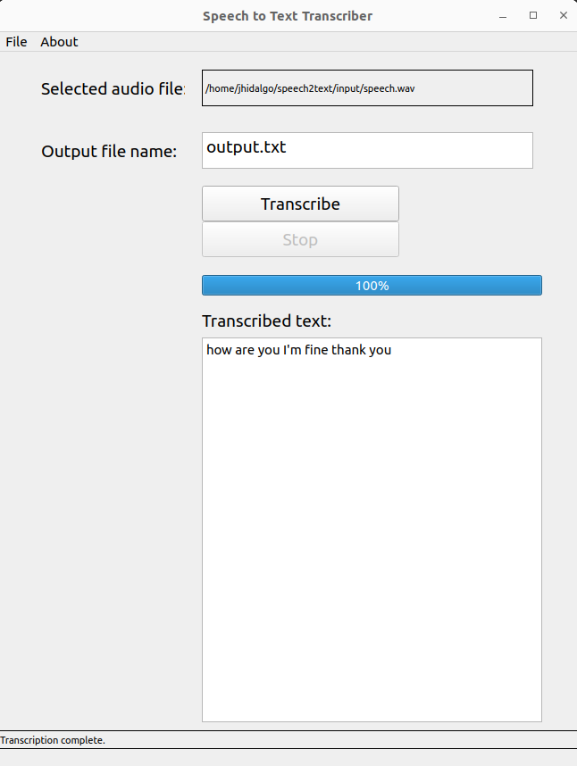

# Speech to Text Transcriber

This project offers a graphical user interface (GUI) application for transcribing audio files into text. It supports various audio formats, such as MP4, WAV, MP3, OGG, FLAC, AAC, and M4A.


## Project Overview

The application, built with Python and the PyQt5 library for the GUI, utilizes Google's speech recognition API, which is handled by the speech_recognition library.


## Features

- **File Selection**: Choose an audio file for transcription.
- **Output Specification**: Specify the name of the output text file.
- **Transcription**: Convert audio content to text.
- **Stop Functionality**: Stop the conversion or transcription process at any time.
- **Progress Display**: Display the progress of the transcription process.
- **Text Output**: View the transcribed text directly in the application.

## Installation

Follow these steps to run the project:

1. **Clone the repository**:
```sh
git clone https://github.com/Jonahida/speech-to-text-transcriber.git

cd speech-to-text-transcriber
```

2. **Create and activate a virtual environment** (optional but recommended):

```sh

python3.9 -m venv env39

source env39/bin/activate  # On Windows use `env39\Scripts\activate`
```

3. **Install the required packages**:
```sh

pip3 install -r requirements.txt
```

## Usage

Open the application:

```sh
python3 main.py
```

Select an input file by clicking on **File -> Open audio file** and choose your video file.

Enter the output file name in the **Output file name** field.

Click the **Transcribe** button to start the transcription process.

View the transcribed text in the text area once the process is complete.

Click the **Stop** button to stop the ongoing conversion or transcription process.

## Screenshots




## Credits

Original code was created by Dr. Alan Davies, Senior Lecturer, Health Data Science, Manchester University, UK

The project was inspired by the article [Transcribing Interview Data from Video to Text with Python](https://towardsdatascience.com/transcribing-interview-data-from-video-to-text-with-python-5cdb6689eea1) on Towards Data Science.


## License
No information